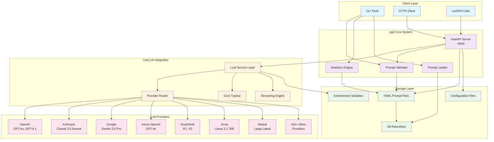
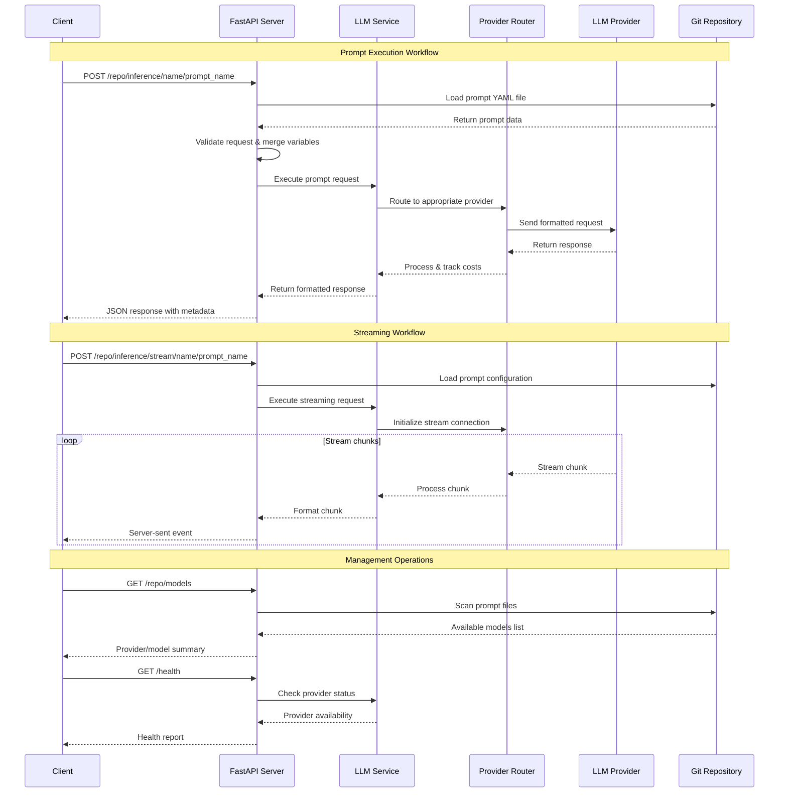

## PGit: A Comprehensive Tool for Managing Language Model Prompts

**PGit** provides a robust, intuitive system to manage all your large language model (LLM) prompts and their associated settings and metadata in a version-controlled, streamlined fashion. By using a structured YAML schema for prompt storage and an API server for interaction with a Git repository, PGit transforms prompts into reusable pieces of code.

The feature-rich software includes:

**1. Prompt Schema:** Store prompts and their associated metadata using a predefined YAML schema. You can also link prompts to represent chains and create "packs" of prompts that represent specific tasks or workflows. The schema accommodates all types of prompt text or templates, and can store details about the LLM provider, model, and settings.

**2. Command-line Utilities:** PGit provides command-line utilities for creating and viewing prompt files. Additionally, these utilities can present statistics about your prompts, providing insight into their distribution and utilization.

**3. API Server:** The API server lets you upload or retrieve prompts easily. With version control enabled through Git, this feature ensures the integrity and traceability of your prompts.

**4. Validation Tools:** With a validation utility, you can ensure that all prompts adhere to the schema and possess unique UUIDs. In case of duplicate UUIDs, the software provides an option to create new ones automatically.

**5. Statistics Utility:** A dedicated command-line utility provides statistics about your prompts. With this, you can view the distribution of category, provider, and model fields in tabulated format, giving you a clear overview of your prompts.

**6. LangChain Compatibility:** PGit prompts can be effortlessly converted to LangChain Prompt Templates using the provided utility.

**7. Prompt Creation:** A command-line utility lets you create a prompt interactively, adhering to the PGit schema. This feature is currently a proof of concept and is under development for further enhancements.

**8. LiteLLM Integration:** ⭐ **NEW** Execute your prompts with real LLMs using LiteLLM's unified interface. Support for 100+ LLM providers including OpenAI, Anthropic, Google, Azure, HuggingFace, and more. Features include streaming responses, cost tracking, and automatic provider routing.

In the ever-growing world of AI, PGit brings a much-needed order to manage language model prompts efficiently. Its features resonate with the industry's demand for traceability and reusability, making it a quintessential tool for anyone dealing with large language models.


## Architecture Overview



## Workflow Diagram



## Technical Overview

**Prompt Validation and Statistics Utility**

This utility is implemented as a Python script that uses the pykwalify library for schema validation and the pandas library for statistics generation. It provides functionalities for prompt validation, statistics generation, and UUID generation. The utility ensures that all prompts adhere to the prompt-serve schema and have unique UUIDs, which is crucial for maintaining the integrity and consistency of the prompts. The statistics generation feature provides insights into the distribution and utilization of the prompts, which can be useful for understanding the composition of the prompt collection and for identifying trends and patterns in the prompts.

## Prompt-Loader

Prompt-Loader is a Python script that uses the requests library to fetch the YAML file containing the prompt from the specified GitHub repository. The YAML file is then parsed using the PyYAML library to extract the prompt data. The script provides options to save the prompt data to a local file or print it to the console in either YAML or JSON format. This script is particularly useful for repositories with a directory structure of /prompts/$category/$promptname.yml.

## Why It's Needed

pgit is needed to manage large collections of prompts in a structured and version-controlled manner. It allows for easy sharing and version control of prompts and enables the association of specific prompts with certain models or settings, such as temperature, penalties, maximum tokens, etc. This is particularly useful when running LLMs locally, as different base models require their prompts in a specific format.
Future Plans

The project plans to add a small API server for uploading/validating new prompts and pushing them to a Git repository. This will further enhance the manageability and reusability of prompts.

## Usage

Both the utility and the script can be run from the command line with various options. For example, to validate all prompts in the prompts/ directory against the schema.yml schema and generate statistics, you can use the following command:

To retrieve a prompt from a GitHub repository and save it to a local file in JSON format, you can use the following command:

```python
python validate.py --schema schema.yml --directory prompts/ --gen-stats
```

To retrieve a prompt from a GitHub repository and save it to a local file in JSON format, you can use the following command:

```python
python prompt_loader.py --repo 'rachittshah/pgit' --prompt 'instruct/summarize' --save 'localfile.json' --json
```

## LiteLLM Integration

### Overview

PGit now includes powerful LLM inference capabilities through [LiteLLM](https://github.com/berriai/litellm) integration. This allows you to not just manage prompts, but actually execute them with real language models from 100+ providers using a unified API.

### Features

- **🌐 Universal Provider Support**: OpenAI, Anthropic, Google, Azure, HuggingFace, Cohere, Replicate, Together AI, Groq, Mistral, and many more
- **🔄 Streaming Responses**: Real-time response streaming for better user experience  
- **💰 Cost Tracking**: Automatic usage and cost monitoring across all providers
- **⚙️ Dynamic Configuration**: Override model settings per request
- **🔑 Secure API Key Management**: Environment variable-based configuration
- **📊 Usage Analytics**: Detailed execution metrics and performance tracking

### Quick Start

#### 1. Installation

Install the required dependencies:

```bash
cd server/
pip install -r requirements.txt
```

#### 2. Configuration

Set up your API keys as environment variables:

```bash
# Copy the example environment file
cp .env.example .env

# Edit .env and add your API keys
export OPENAI_API_KEY="your_openai_key_here"
export ANTHROPIC_API_KEY="your_anthropic_key_here"
export GOOGLE_API_KEY="your_google_key_here"
# ... add other providers as needed
```

Configure pgit:

```bash
cp ps.conf.example ps.conf
# Edit ps.conf to set your repository path
```

#### 3. Start the Server

```bash
cd server/
python -m uvicorn api:app --host 0.0.0.0 --port 8000
```

#### 4. Execute Prompts

Execute a prompt via the API:

```bash
curl -X POST "http://localhost:8000/your_repo/inference/name/openai-gpt4-analysis" \
  -H "Content-Type: application/json" \
  -d '{
    "input_variables": {
      "text": "This is a wonderful day! The weather is perfect."
    },
    "override_settings": {
      "temperature": 0.7,
      "max_tokens": 300
    }
  }'
```

### API Endpoints

#### Health & Configuration

- `GET /health` - Health check with provider status
- `GET /config` - Configuration summary and API key status

#### Model Discovery  

- `GET /{repo}/models` - List available models from repository prompts

#### Prompt Execution

- `POST /{repo}/inference/name/{prompt_name}` - Execute prompt by name
- `POST /{repo}/inference/uuid/{prompt_uuid}` - Execute prompt by UUID
- `POST /{repo}/inference/stream/name/{prompt_name}` - Streaming execution

### Request/Response Format

#### Request Body

```json
{
  "input_variables": {
    "variable1": "value1",
    "variable2": "value2"
  },
  "override_settings": {
    "temperature": 0.7,
    "max_tokens": 500,
    "top_p": 0.9
  },
  "stream": false,
  "include_raw_response": false
}
```

#### Response Format

```json
{
  "response": "Generated text from the LLM...",
  "metadata": {
    "prompt_id": "uuid-here",
    "prompt_title": "Prompt Title",
    "model": "openai/gpt-4",
    "provider": "openai",
    "usage": {
      "prompt_tokens": 50,
      "completion_tokens": 100,
      "total_tokens": 150,
      "cost": 0.002
    },
    "execution_time": 1.23,
    "timestamp": "2024-01-01T12:00:00Z"
  }
}
```

### Example Prompts

The repository includes example prompts for major providers in `prompts/litellm/`:

- `openai-gpt4-analysis.yml` - Text analysis with OpenAI GPT-4
- `anthropic-claude-creative.yml` - Creative writing with Claude
- `google-gemini-research.yml` - Research assistance with Gemini
- `ollama-local-code.yml` - Code generation with local Ollama models
- `huggingface-translator.yml` - Translation with HuggingFace models

### Supported Providers (2024-2025 Latest Models)

| Provider | Environment Variable | Latest Models |
|----------|---------------------|---------------|
| OpenAI | `OPENAI_API_KEY` | `gpt-4o`, `gpt-4.1`, `o3-mini`, `gpt-image-1` |
| Anthropic | `ANTHROPIC_API_KEY` | `claude-3-5-sonnet-20241022`, `claude-4-opus` |
| Google | `GOOGLE_API_KEY` | `gemini-2.5-pro`, `gemini-2.5-flash` |
| Azure OpenAI | `AZURE_API_KEY` | `azure/gpt-4o`, `azure/computer-use-preview` |
| DeepSeek | `DEEPSEEK_API_KEY` | `deepseek-r1`, `deepseek-v3` |
| HuggingFace | `HUGGINGFACE_API_KEY` | `together/deepseek-ai/DeepSeek-R1` |
| Groq | `GROQ_API_KEY` | `llama-3.1-70b-versatile`, `qwen3-32b` |
| Mistral | `MISTRAL_API_KEY` | `mistral-large-latest`, `magistral-medium` |
| Cohere | `COHERE_API_KEY` | `command-a-03-2025` |
| Novita AI | `NOVITA_API_KEY` | `deepseek/deepseek-r1`, `llama-3.3-70b` |
| Bedrock | `AWS_ACCESS_KEY_ID` | `claude-4-opus`, `us.deepseek.r1-v1:0` |
| Ollama | N/A (local) | `llama3.1`, `deepseek-r1` (with wildcards) |

### Testing

Run the integration test suite:

```bash
python test_litellm_integration.py
```

This will test all endpoints and provide a comprehensive report of the integration status.

### Error Handling

The API provides detailed error messages for common issues:

- Missing API keys
- Invalid prompt variables  
- Model availability issues
- Rate limiting
- Network errors

### Cost Management

- Automatic cost calculation for supported providers
- Usage tracking per prompt execution
- Token consumption monitoring
- Cost alerts and budgeting (planned)

### Performance

- Async execution for better throughput
- Connection pooling for provider APIs
- Caching for improved response times
- Automatic retry logic with exponential backoff

### Security

- API keys stored as environment variables only
- No logging of sensitive information
- Request validation and sanitization
- Optional authentication (configurable)

For more details, see the [LiteLLM documentation](https://docs.litellm.ai/).